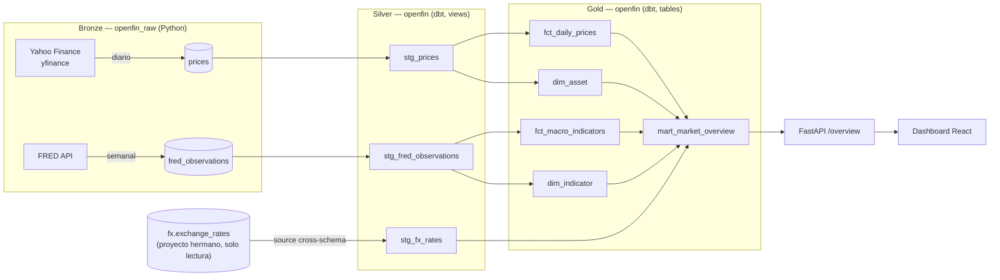

# Open Finance Pipeline


Pipeline de datos financieros con **arquitectura Medallion (Bronze → Silver →
Gold)**: combina precios de mercado (**Yahoo Finance**), indicadores macro de
EE.UU. (**FRED**) y la brecha cambiaria de Bolivia (reutilizada de un proyecto
hermano), transformados con **dbt** y expuestos vía **API REST (FastAPI)** y un
**dashboard React**.

> Tercer proyecto de portafolio de Ingeniería de Datos. Es la síntesis de los
> dos anteriores: reutiliza el patrón EL(Python)+T(dbt) de
> [Latam Economic Pulse](https://github.com/Horaciomb/latam-economic-pulse) y
> el dato de tipo de cambio de
> [Bolivia Exchange Rate Tracker](https://github.com/Horaciomb/bolivia-exchange-tracker),
> y añade una arquitectura Medallion explícita más un frontend de visualización.

🚀 **API en vivo:** _(pendiente de deploy — se agregará el link tras publicar en Render)_
📊 **Documentación dbt (lineage + catálogo):** https://horaciomb.github.io/open-finance-pipeline/
🖥️ **Dashboard:** _(pendiente de deploy en Vercel)_

---

## Arquitectura Medallion



**Separación clave:** Python hace **sólo EL** (extract + load crudo,
idempotente). **Toda la transformación vive en dbt** — staging limpia y
tipa, marts calculan lo que consume el API.

---

## Modelo de datos

| Capa | Esquema | Objeto | Materialización | Descripción |
|------|---------|--------|-----------------|-------------|
| Bronze | `openfin_raw` | `prices` | tabla (Python) | OHLCV crudo, grano ticker×fecha. |
| Bronze | `openfin_raw` | `fred_observations` | tabla (Python) | Observaciones FRED crudas; `valor` nulo si la fuente devolvió `"."`. |
| Silver | `openfin` | `stg_prices` | view | Tipado. |
| Silver | `openfin` | `stg_fred_observations` | view | Tipado; **conserva** nulos (huecos reales, no error). |
| Silver | `openfin` | `stg_fx_rates` | view | `source()` cross-schema a `fx.exchange_rates` (proyecto hermano). |
| Gold | `openfin` | `dim_asset` / `dim_indicator` | table | Catálogos (seeds + tickers/series observados). |
| Gold | `openfin` | `fct_daily_prices` / `fct_macro_indicators` | table | Hechos, grano ticker×fecha / series×fecha. |
| Gold | `openfin` | `mart_market_overview` | table | Snapshot diario combinado (formato tidy) que alimenta el API/dashboard. |

**Nota de diseño — brecha cambiaria:** en `fx.exchange_rates`, oficial vs.
paralelo **no son columnas**, son filas distintas (`casa = 'oficial' |
'binance'`), y no siempre reportan el mismo día. `mart_market_overview` calcula
el último valor de cada `casa` **de forma independiente** en vez de asumir una
fecha compartida — un caso real encontrado y corregido durante el desarrollo.

---

## Endpoints

| Método | Ruta | Descripción |
|--------|------|-------------|
| GET | `/` | Info + enlaces a `/docs`, dbt docs y dashboard. |
| GET | `/health` | Estado del API + conexión a la base. |
| GET | `/prices/latest` | Último precio de cada activo trackeado. |
| GET | `/prices/{ticker}?desde=&hasta=` | Serie histórica OHLCV de un ticker. |
| GET | `/macro/latest` | Último valor de cada indicador FRED. |
| GET | `/macro/{series_id}` | Serie histórica de un indicador. |
| GET | `/fx/latest` | Última brecha cambiaria de Bolivia (oficial vs. paralelo). |
| GET | `/overview` | Snapshot combinado que consume el dashboard. |

---

## Setup

### 1. Requisitos
- Python 3.11+.
- Node 18+ (para el frontend).
- Acceso a una instancia PostgreSQL (este proyecto usa una instancia Supabase
  **compartida**, en los esquemas nuevos `openfin_raw` y `openfin`).
- Una API key gratuita de FRED: registrarse en
  https://fred.stlouisfed.org/docs/api/api_key.html (instantánea, solo pide
  nombre/email/uso previsto).

### 2. Instalar (Python)
```bash
python -m venv venv
source venv/Scripts/activate    # Windows: venv\Scripts\activate
pip install -r requirements.txt

# En Python 3.14, aplicar el override de mashumaro como paso SEPARADO (dbt-core
# fija mashumaro<3.15 y eso rompe en 3.14; ver el comentario en requirements.txt
# sobre por qué no puede ir en la misma instalación).
pip install --upgrade "mashumaro>=3.18,<4.0"
```

### 3. Configurar entorno
```bash
cp .env.example .env
# Editar .env con tu DATABASE_URL (conexión directa / session, puerto 5432)
# y tu FRED_API_KEY.
```

### 4. Crear esquemas y tablas crudas (una vez)
```bash
psql "$DATABASE_URL" -f sql/bootstrap.sql
```

### 5. Correr el EL (carga cruda)
```bash
python -m src.el.pipeline prices   # diario
python -m src.el.pipeline fred     # semanal
```

### 6. Transformar con dbt
```bash
eval "$(python scripts/parse_database_url.py --export)"  # deriva PG* desde DATABASE_URL

cd dbt
dbt deps
dbt debug
dbt build          # seeds + staging + marts + tests
dbt docs generate  # catálogo + lineage
```

### 7. Levantar el API
```bash
uvicorn src.api.main:app --reload
# Swagger en http://localhost:8000/docs
```

### 8. Levantar el dashboard
```bash
cd frontend
cp .env.example .env   # VITE_API_URL=http://localhost:8000
npm install
npm run dev            # http://localhost:5173
```

### 9. Desplegar el API en Render (free tier)

El repo incluye un [Blueprint](render.yaml) (`render.yaml`) que Render detecta
automáticamente — no hace falta configurar build/start command a mano.

1. Entrar a [Render](https://dashboard.render.com/) → **New +** → **Blueprint**.
2. Conectar el repo `Horaciomb/open-finance-pipeline`, rama `main`.
3. Render lee `render.yaml` y muestra el servicio `open-finance-pipeline-api`.
   Al pedir `DATABASE_URL` (marcada como secreto, no está en el repo), pegar
   la connection string real (la del pooler Supabase, puerto 5432).
   `CORS_EXTRA_ORIGIN` y `DASHBOARD_URL` se pueden dejar vacías por ahora y
   completarse después de desplegar el frontend (paso 10).
4. **Apply** → Render instala `requirements.txt` y arranca con
   `uvicorn src.api.main:app --host 0.0.0.0 --port $PORT`.
5. Verificar `https://<tu-servicio>.onrender.com/health` una vez desplegado.

> Nota: el plan free de Render duerme el servicio tras 15 min de inactividad;
> el primer request tras un tiempo de inactividad puede tardar ~30-50s en
> responder (cold start).

### 10. Desplegar el dashboard en Vercel

1. Entrar a [Vercel](https://vercel.com/new) → importar el repo
   `Horaciomb/open-finance-pipeline`.
2. **Root Directory:** `frontend` (Vercel detecta Vite automáticamente —
   build command `npm run build`, output `dist`).
3. Variable de entorno: `VITE_API_URL` = la URL de Render del paso 9
   (ej. `https://open-finance-pipeline-api.onrender.com`).
4. Deploy. Una vez tengas la URL de Vercel, volver a Render y setear
   `CORS_EXTRA_ORIGIN` con esa URL (paso 9.3) para que el API acepte
   requests del dashboard en producción.

---

## Tests y calidad
```bash
pytest                # extract / load / API (mocks, sin DB ni red)
ruff check .           # linting
cd dbt && dbt build    # tests de dbt (not_null, unique, relationships, accepted_values)
cd frontend && npm run build   # build de producción del dashboard
```

---

## Decisiones de diseño

### 1. Un único esquema `openfin` para todo dbt
La instancia Supabase es **compartida** (ya tiene `public`, `polla`, `fx`,
`econ_raw`/`econ`). La macro [`generate_schema_name`](dbt/macros/generate_schema_name.sql)
fuerza que **todos** los modelos (staging y marts) se materialicen en
`openfin`, en vez del comportamiento por defecto de dbt (`openfin_staging`,
`openfin_marts`).

### 2. `DATABASE_URL` → variables `PG*` para dbt
`dbt-postgres` no acepta una connection string. [`scripts/parse_database_url.py`](scripts/parse_database_url.py)
la descompone en las 5 variables `PG*` justo antes de correr dbt, en CI y en
local. Cero credenciales hardcodeadas.

### 3. El tipo de cambio de Bolivia se reutiliza, no se re-extrae
`stg_fx_rates` es un `source()` cross-schema hacia `fx.exchange_rates` (dato
ya extraído por el proyecto hermano). Este proyecto solo lee — nunca escribe
en el esquema `fx`.

### 4. El descarte/conservación de nulos es decisión explícita por fuente
FRED deja huecos reales (feriados, series aún no publicadas: `"."` en la
respuesta). Python landea todo crudo en `openfin_raw`; `stg_fred_observations`
**conserva** los nulos (no son errores de calidad); `fct_macro_indicators` no
fuerza `not_null` en `valor` por la misma razón.

### 5. Compatibilidad dbt-core + Python 3.14
`dbt-core` fija `mashumaro<3.15`, pero ese rango falla en Python 3.14
(`UnserializableField` al construir el JSON schema de `dbt_common`).
`dbt-core`/`dbt-postgres` quedan **pineados a versiones exactas** (no `>=`) en
`requirements.txt` para que un `pip install` futuro no arrastre silenciosamente
un release con un tope de mashumaro distinto. El override de mashumaro
(`>=3.18,<4.0`) **no puede vivir en el mismo `requirements.txt`** — el propio
`dbt-core` declara `mashumaro<3.15`, así que pedirle a pip resolver ambas
restricciones en una sola pasada falla con `ResolutionImpossible` (se comprobó
con una instalación limpia). Por eso el override se aplica como un
**segundo paso de `pip install --upgrade`** después de `pip install -r
requirements.txt`, tanto en local (ver Setup) como en los 4 workflows de CI.

### 6. CORS solo en este proyecto
A diferencia de los proyectos hermanos (sin frontend), este API habilita CORS
para `http://localhost:5173` (+ un origen extra configurable vía
`CORS_EXTRA_ORIGIN` para el futuro deploy en Vercel), sin credenciales, solo
`GET`.

---

## Stack

Python 3.11+ · yfinance · requests · **dbt-core + dbt-postgres** · PostgreSQL
(Supabase) · FastAPI · pydantic v2 · pytest · ruff · React + Vite + Recharts ·
GitHub Actions · GitHub Pages.
